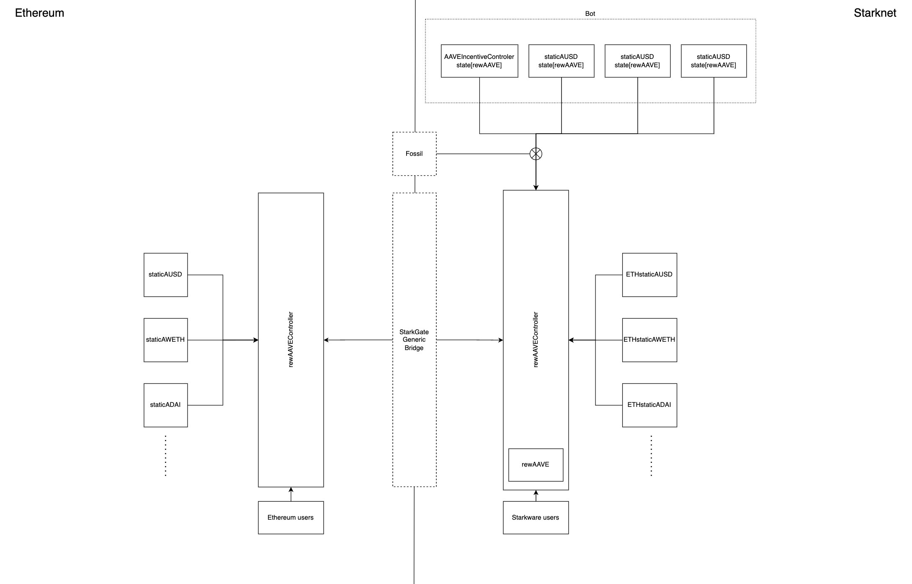

# Starknet AAVE rewards

A staticAToken bridge to Starknet for cheap AAVE rewards collection and token
exchange.

## Architecture


## Testing

The project is tested using [hardhat](https://hardhat.org/), the [starknet
hardhat plugin](https://github.com/Shard-Labs/starknet-hardhat-plugin) and
[starknet-devnet](https://github.com/Shard-Labs/starknet-devnet).

### Prerequisites

Before installing cairo you'll need to install GMP

```bash
sudo apt install -y libgmp3-dev # linux
brew install gmp # mac
```

```bash
nvm install 16

yarn
yarn prepare # to setup the pre-commit hook

npm install -g ganache@7.0.4

python3.7 -m venv .venv
source .venv/bin/activate
pip install poetry
poetry install
```

### Start the testnets

It's wise to do this in two separate shells.

```bash
ganache --fork https://eth-mainnet.alchemyapi.io/v2/$ALCHEMY_KEY@$BLOCK_NUMBER --gasPrice 2000000000000 -u $DAI_WHALE -u $USDC_WHALE -u $STKAAVE_WHALE
```

```bash
starknet-devnet --host 0.0.0.0
```

### Build the cairo files

```bash
yarn compile
```

### Run the tests

```
yarn test
```

### Notes

When transferring the token across the bridge the unclaimed rewards to date
will still be associated with the owners account on L1. These old rewards can
not be claimed on Starknet.
